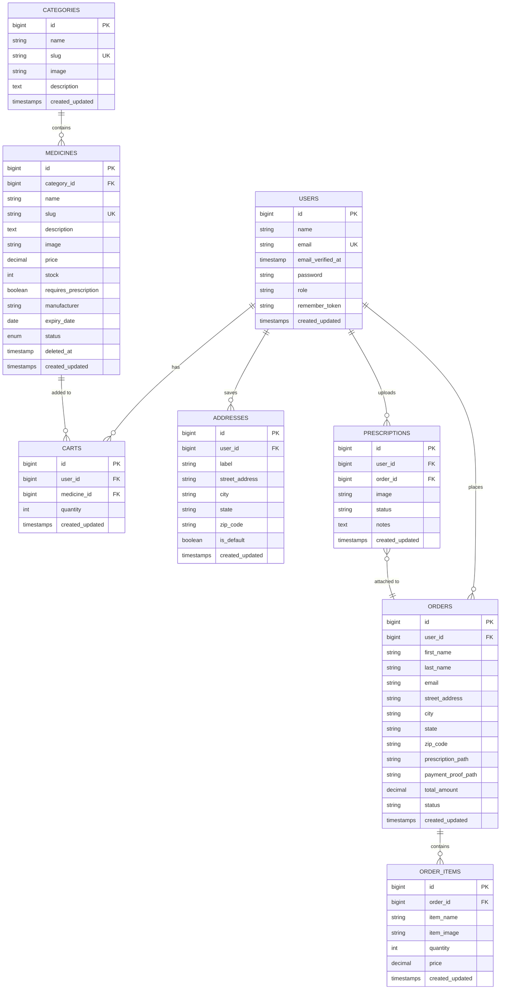

---

<p align="center">
  
</p>

<h1 align="center">MediOrder AI</h1>
<h3 align="center">AI-Powered Online Medicine Ordering System</h3>
<h4 align="center">Project Documentation</h4>

<p align="center">
  <strong>Version:</strong> 1.0 &nbsp;&nbsp;|&nbsp;&nbsp;
  <strong>Date:</strong> July 2026 &nbsp;&nbsp;|&nbsp;&nbsp;
  <strong>Author:</strong> Samrat
</p>

---

<br>

# Table of Contents

| # | Section | Page |
|---|---|---|xs
| 1 | [Introduction](#1-introduction) | — |
| 2 | [Project Objectives](#2-project-objectives) | — |
| 3 | [Scope of the Project](#3-scope-of-the-project) | — |
| 4 | [Literature Survey / Existing Systems](#4-literature-survey--existing-systems) | — |
| 5 | [System Requirements](#5-system-requirements) | — |
| 6 | [System Architecture & Design](#6-system-architecture--design) | — |
| 7 | [Database Design](#7-database-design) | — |
| 8 | [Module Description](#8-module-description) | — |
| 9 | [Implementation Details](#9-implementation-details) | — |
| 10 | [User Interface Design](#10-user-interface-design) | — |
| 11 | [Testing & Validation](#11-testing--validation) | — |
| 12 | [Installation & Deployment Guide](#12-installation--deployment-guide) | — |
| 13 | [Security Considerations](#13-security-considerations) | — |
| 14 | [Limitations](#14-limitations) | — |
| 15 | [Future Enhancements](#15-future-enhancements) | — |
| 16 | [Conclusion](#16-conclusion) | — |
| 17 | [References](#17-references) | — |
| A | [Appendix A — Directory Structure](#appendix-a--directory-structure) | — |
| B | [Appendix B — API Specification](#appendix-b--api-specification) | — |
| C | [Appendix C — Route Reference](#appendix-c--route-reference) | — |

---

<br>

# 1. Introduction

## 1.1 Background

The healthcare industry is undergoing a rapid digital transformation. Consumers increasingly expect the same convenience from pharmacies that they enjoy in e-commerce — browsing products online, adding items to a cart, placing orders from home, and tracking deliveries in real time. However, medicine ordering carries unique requirements: prescription verification, regulatory compliance, and the need for reliable health information.

**MediOrder AI** addresses these challenges by combining a full-featured e-commerce platform with an AI-powered pharmacist chatbot. The system enables customers to browse a curated medicine catalog, upload prescriptions, place orders, and receive intelligent medicine recommendations — all from a single, cohesive web application.

## 1.2 Problem Statement

Traditional pharmacy systems suffer from the following limitations:

1. **Physical Constraints** — Customers must visit a store, wait in queues, and rely on limited store hours.
2. **Information Gaps** — Customers often lack knowledge about which medicines suit their symptoms, leading to uninformed purchases or unnecessary doctor visits for minor ailments.
3. **Prescription Management** — Paper prescriptions are easily lost or damaged, creating friction during repeat purchases.
4. **Inventory Blindness** — Store administrators lack real-time visibility into stock levels, resulting in stockouts and lost revenue.
5. **No Order Visibility** — Once an order is placed (especially for delivery), customers have no way to track its progress.

## 1.3 Proposed Solution

MediOrder AI is a web-based medicine ordering platform that solves the above problems through:

- A **digital medicine catalog** with category-based browsing, search, and filtering.
- An **AI-powered pharmacist chatbot** that recommends medicines based on symptoms, grounded entirely in the platform's own catalog data (Retrieval-Augmented Generation).
- **Digital prescription uploads** that are stored securely alongside each order.
- An **admin dashboard** with real-time analytics, inventory alerts, and order management.
- A **visual order tracking system** that gives customers full transparency into their order status.

## 1.4 Technology Overview

| Component | Technology |
|---|---|
| Backend Framework | Laravel 12 (PHP 8.2+) |
| Frontend | Blade Templates, TailwindCSS 3, Alpine.js 3 |
| Database | MySQL 8.0 |
| AI Engine | DeepSeek Chat V3 via OpenRouter API |
| Build Tools | Vite 7, PostCSS, Autoprefixer |
| Authentication | Laravel Breeze |
| Testing | Pest PHP 3 |
| Version Control | Git |

---

<br>

# 2. Project Objectives

The primary objectives of the MediOrder AI project are:

| # | Objective | Description |
|---|---|---|
| O1 | **Online Medicine Ordering** | Enable customers to browse, search, and purchase medicines through a web-based platform without visiting a physical store. |
| O2 | **AI-Powered Health Assistance** | Provide an intelligent chatbot that maps user symptoms to relevant medicines from the catalog, offering grounded and safe recommendations. |
| O3 | **Prescription Management** | Allow digital upload and secure storage of prescriptions during the checkout process. |
| O4 | **Order Lifecycle Management** | Implement a complete order workflow — from placement through processing, shipping, and delivery — with real-time status tracking for customers. |
| O5 | **Admin Analytics & Inventory Control** | Equip administrators with a dashboard showing key metrics (orders, revenue, low-stock alerts) and tools to manage categories, medicines, and orders. |
| O6 | **Saved Address Management** | Allow returning customers to save, reuse, and manage shipping addresses for faster checkout. |
| O7 | **Role-Based Access Control** | Enforce strict separation between customer and admin functionality through middleware-based authorization. |

---

<br>

# 3. Scope of the Project

## 3.1 In Scope

- User registration and authentication (login, register, password reset, email verification)
- Medicine catalog with categories, search, and category-based filtering
- Session-based shopping cart (add, remove, quantity management)
- Checkout with contact info, shipping address, prescription upload, and payment proof upload
- Order placement with itemized line items
- Customer order history and visual order tracking (4-step progress bar)
- AI pharmacist chatbot with RAG-based medicine recommendations
- Admin dashboard with analytics (today's orders, revenue, low-stock alerts)
- Admin CRUD for categories (create, edit, delete with image upload)
- Admin CRUD for medicines (create, delete with full attribute management)
- Admin order management with status updates
- Saved addresses with labels and duplicate detection
- Responsive design for mobile and desktop

## 3.2 Out of Scope (Current Version)

- Online payment gateway integration (UPI, card payments)
- Real-time delivery tracking with GPS
- SMS/email notifications for order status changes
- Multi-vendor marketplace functionality
- Inventory auto-reorder system
- Prescription OCR (optical character recognition)
- Multi-language support
- Mobile native applications (Android/iOS)

---

<br>

# 4. Literature Survey / Existing Systems

## 4.1 Existing Online Pharmacy Platforms

| Platform | Strengths | Limitations |
|---|---|---|
| **1mg** | Large catalog, lab tests, doctor consultations | No AI chatbot; complex UI for elderly users |
| **PharmEasy** | Subscription model, good discounts | Limited symptom-based search; no conversational AI |
| **Netmeds** | Fast delivery, good availability | No AI assistance; basic search only |
| **Apollo Pharmacy** | Trusted brand, doctor network | Heavy app-dependent; web experience is secondary |

## 4.2 Gap Analysis

| Gap | MediOrder AI Approach |
|---|---|
| No AI-driven medicine recommendations | RAG-based chatbot grounded in catalog data |
| Symptom-to-medicine discovery is absent | Built-in symptom keyword mapping + LLM reasoning |
| Complex UIs | Clean, minimal interface with TailwindCSS |
| No admin inventory alerts | Dashboard with low-stock medicine alerts |
| No transparent order tracking | 4-step visual progress bar for customers |

## 4.3 Novelty of MediOrder AI

The core differentiator of MediOrder AI is the integration of a **Retrieval-Augmented Generation (RAG)** chatbot directly within the pharmacy platform. Unlike generic AI chatbots, MediOrder's chatbot:

1. **Searches the actual medicine database** before generating a response.
2. **Renders interactive product cards** alongside text recommendations.
3. **Allows adding items to cart directly from the chat** — eliminating friction between discovery and purchase.
4. **Includes safety guardrails** — medical disclaimers, strict grounding, and fallback responses.

---

<br>

# 5. System Requirements

## 5.1 Hardware Requirements

| Component | Minimum Requirement |
|---|---|
| Processor | Intel Core i3 / AMD Ryzen 3 or equivalent |
| RAM | 4 GB (8 GB recommended) |
| Storage | 500 MB free disk space (excluding database) |
| Network | Broadband internet connection |

## 5.2 Software Requirements

| Software | Version | Purpose |
|---|---|---|
| PHP | 8.2 or higher | Server-side runtime |
| Composer | 2.x | PHP dependency management |
| Node.js | 18+ | Frontend build tools |
| npm | 9+ | JavaScript package management |
| MySQL | 8.0+ | Database server |
| Git | 2.x+ | Version control |
| Web Browser | Chrome 100+ / Firefox 100+ / Edge 100+ | Client access |

## 5.3 Software Dependencies

### Backend (PHP — via Composer)

| Package | Version | Purpose |
|---|---|---|
| `laravel/framework` | ^12.0 | Core application framework |
| `laravel/tinker` | ^2.10.1 | REPL for debugging |
| `laravel/breeze` | ^2.4 | Authentication scaffolding |
| `laravel/sail` | ^1.41 | Docker development environment |
| `laravel/pint` | ^1.24 | Code style formatting |
| `laravel/pail` | ^1.2.2 | Real-time log viewer |
| `pestphp/pest` | ^3.8 | Testing framework |
| `fakerphp/faker` | ^1.23 | Test data generation |

### Frontend (JavaScript — via npm)

| Package | Version | Purpose |
|---|---|---|
| `tailwindcss` | ^3.1.0 | Utility-first CSS framework |
| `@tailwindcss/forms` | ^0.5.2 | Form element styling |
| `alpinejs` | ^3.4.2 | Lightweight reactive JS framework |
| `axios` | ^1.11.0 | HTTP client for AJAX requests |
| `vite` | ^7.0.7 | Asset bundling and HMR |
| `laravel-vite-plugin` | ^2.0.0 | Laravel-Vite integration |

---

<br>

# 6. System Architecture & Design

## 6.1 Architectural Pattern

MediOrder AI follows the **Model-View-Controller (MVC)** architectural pattern as provided by the Laravel framework:

```
┌───────────────────────────────────────────────────┐
│                    CLIENT LAYER                    │
│   Browser → Blade Templates + TailwindCSS +       │
│   Alpine.js + Axios                               │
└──────────────────────┬────────────────────────────┘
                       │ HTTP Request/Response
                       ▼
┌───────────────────────────────────────────────────┐
│               APPLICATION LAYER                    │
│                                                    │
│  ┌──────────┐  ┌──────────────┐  ┌─────────────┐  │
│  │  Routes  │→ │  Middleware   │→ │ Controllers  │  │
│  │ web.php  │  │ auth, admin   │  │  12 total    │  │
│  │ auth.php │  │ csrf, throttle│  │              │  │
│  └──────────┘  └──────────────┘  └──────┬───────┘  │
│                                         │          │
│  ┌──────────────────────────────────────▼───────┐  │
│  │              MODEL LAYER (Eloquent ORM)       │  │
│  │  User │ Medicine │ Category │ Cart │ Order    │  │
│  │  OrderItem │ Address │ Prescription           │  │
│  └──────────────────────────────────────┬───────┘  │
│                                         │          │
└─────────────────────────────────────────┼──────────┘
                                          │
            ┌─────────────────────────────┼──────────────────┐
            ▼                             ▼                  ▼
     ┌─────────────┐              ┌─────────────┐    ┌──────────────┐
     │   MySQL     │              │   Local      │    │  OpenRouter  │
     │   Database  │              │   File       │    │  AI API      │
     │             │              │   Storage    │    │  (DeepSeek)  │
     └─────────────┘              └─────────────┘    └──────────────┘
```

## 6.2 Data Flow Diagram — Level 0 (Context Diagram)

```
                    ┌─────────────┐
       Search,      │             │     Medicine Data,
       Browse,  ───→│             │───→ Order Status,
       Order,       │  MediOrder  │     AI Responses
       Chat     ←───│     AI      │←───
                    │  (System)   │
  ┌──────────┐      │             │     ┌──────────────┐
  │ Customer │      └──────┬──────┘     │ OpenRouter   │
  └──────────┘             │            │ AI Service   │
                           │            └──────────────┘
                    ┌──────▼──────┐
                    │   Admin     │
                    │   User      │
                    └─────────────┘
                    Manage Products,
                    Update Orders,
                    View Analytics
```

## 6.3 Data Flow Diagram — Level 1

```
┌──────────────────────────────────────────────────────────────────────┐
│                         MediOrder AI System                          │
│                                                                      │
│  ┌─────────┐    ┌──────────────┐    ┌──────────────┐                 │
│  │ 1.0     │    │ 2.0          │    │ 3.0          │                 │
│  │ Auth    │    │ Medicine     │    │ Cart         │                 │
│  │ Module  │    │ Browsing     │    │ Management   │                 │
│  └────┬────┘    └──────┬───────┘    └──────┬───────┘                 │
│       │                │                    │                        │
│       ▼                ▼                    ▼                        │
│  ┌─────────┐    ┌──────────────┐    ┌──────────────┐                 │
│  │ D1      │    │ D2           │    │ D3           │                 │
│  │ Users   │    │ Medicines    │    │ Session      │                 │
│  │ Store   │    │ Store        │    │ (Cart Data)  │                 │
│  └─────────┘    └──────────────┘    └──────────────┘                 │
│                                                                      │
│  ┌─────────┐    ┌──────────────┐    ┌──────────────┐                 │
│  │ 4.0     │    │ 5.0          │    │ 6.0          │                 │
│  │ Checkout│    │ Order        │    │ AI Chatbot   │                 │
│  │ & Order │    │ Tracking     │    │ (RAG)        │                 │
│  └────┬────┘    └──────┬───────┘    └──────┬───────┘                 │
│       │                │                    │                        │
│       ▼                ▼                    ▼                        │
│  ┌─────────┐    ┌──────────────┐    ┌──────────────┐                 │
│  │ D4      │    │ D4           │    │ External     │                 │
│  │ Orders  │    │ Orders       │    │ AI Service   │                 │
│  │ Store   │    │ Store        │    │ (OpenRouter) │                 │
│  └─────────┘    └──────────────┘    └──────────────┘                 │
│                                                                      │
│  ┌──────────────────────────────────────────────────┐                │
│  │ 7.0  Admin Module                                │                │
│  │  Dashboard │ Category CRUD │ Medicine CRUD │      │                │
│  │  Order Management                                │                │
│  └──────────────────────────────────────────────────┘                │
└──────────────────────────────────────────────────────────────────────┘
```

## 6.4 Use Case Diagram

```
                        ┌─────────────────────────────────────────┐
                        │           MediOrder AI System            │
                        │                                          │
  ┌──────────┐          │  ┌──────────────────────┐                │
  │          │─────────▶│  │  Register / Login     │                │
  │          │          │  └──────────────────────┘                │
  │          │─────────▶│  ┌──────────────────────┐                │
  │          │          │  │  Browse Medicines     │                │
  │          │          │  └──────────────────────┘                │
  │          │─────────▶│  ┌──────────────────────┐                │
  │ Customer │          │  │  Search Medicines     │                │
  │          │          │  └──────────────────────┘                │
  │          │─────────▶│  ┌──────────────────────┐                │
  │          │          │  │  Manage Cart          │                │
  │          │          │  └──────────────────────┘                │
  │          │─────────▶│  ┌──────────────────────┐                │
  │          │          │  │  Checkout & Place Order│               │
  │          │          │  └──────────────────────┘                │
  │          │─────────▶│  ┌──────────────────────┐                │
  │          │          │  │  Track Orders         │                │
  │          │          │  └──────────────────────┘                │
  │          │─────────▶│  ┌──────────────────────┐                │
  │          │          │  │  Chat with AI Bot     │                │
  │          │          │  └──────────────────────┘                │
  │          │─────────▶│  ┌──────────────────────┐                │
  │          │          │  │  Manage Profile       │                │
  └──────────┘          │  └──────────────────────┘                │
                        │                                          │
  ┌──────────┐          │  ┌──────────────────────┐                │
  │          │─────────▶│  │  View Dashboard       │                │
  │          │          │  └──────────────────────┘                │
  │          │─────────▶│  ┌──────────────────────┐                │
  │  Admin   │          │  │  Manage Categories    │                │
  │          │          │  └──────────────────────┘                │
  │          │─────────▶│  ┌──────────────────────┐                │
  │          │          │  │  Manage Medicines     │                │
  │          │          │  └──────────────────────┘                │
  │          │─────────▶│  ┌──────────────────────┐                │
  │          │          │  │  Manage Orders        │                │
  └──────────┘          │  └──────────────────────┘                │
                        └─────────────────────────────────────────┘
```

## 6.5 Sequence Diagram — Order Placement

```
Customer          Browser           CartController    CheckoutController    DB        FileStorage
   │                 │                    │                   │              │              │
   │── Add to Cart──▶│                    │                   │              │              │
   │                 │── POST /cart/add ─▶│                   │              │              │
   │                 │                    │── Store in        │              │              │
   │                 │                    │   Session ───────▶│              │              │
   │                 │◀── Redirect ──────│                   │              │              │
   │◀── Cart Badge ──│                    │                   │              │              │
   │                 │                    │                   │              │              │
   │── Go Checkout──▶│                    │                   │              │              │
   │                 │── GET /checkout ──────────────────────▶│              │              │
   │                 │                    │                   │── Load Cart  │              │
   │                 │                    │                   │── Load Addrs─▶│              │
   │                 │◀── Checkout Form ────────────────────-│              │              │
   │                 │                    │                   │              │              │
   │── Submit Form──▶│                    │                   │              │              │
   │  (+ Files)      │── POST /checkout/store ──────────────▶│              │              │
   │                 │                    │                   │── Validate   │              │
   │                 │                    │                   │── Store Files─────────────▶│
   │                 │                    │                   │── Create     │              │
   │                 │                    │                   │   Order ────▶│              │
   │                 │                    │                   │── Create     │              │
   │                 │                    │                   │   Items ────▶│              │
   │                 │                    │                   │── Save Addr? │              │
   │                 │                    │                   │── Clear Cart │              │
   │                 │◀── Redirect to Success ───────────────│              │              │
   │◀── Success Page─│                    │                   │              │              │
```

## 6.6 Sequence Diagram — AI Chatbot Interaction

```
Customer      Browser        ChatbotController       MySQL          OpenRouter API
   │             │                   │                  │                  │
   │─ Type Msg ─▶│                   │                  │                  │
   │             │── POST /chatbot/ask ─────────────▶│                  │                  │
   │             │                   │                  │                  │
   │             │                   │── Extract Keywords│                  │
   │             │                   │── Map Symptoms   │                  │
   │             │                   │                  │                  │
   │             │                   │── Search LIKE ──▶│                  │
   │             │                   │◀── Medicines ───│                  │
   │             │                   │                  │                  │
   │             │                   │── Build Context  │                  │
   │             │                   │── Build Prompt   │                  │
   │             │                   │                  │                  │
   │             │                   │── POST /chat/completions ─────────▶│
   │             │                   │◀── AI Reply ──────────────────────│
   │             │                   │                  │                  │
   │             │◀── {reply, products[]} ──────────│                  │
   │◀── Display ─│                   │                  │                  │
   │   + Cards   │                   │                  │                  │
```

---

<br>

# 7. Database Design

## 7.1 Entity-Relationship Diagram



## 7.2 Table Definitions

### 7.2.1 `users` Table

| Column | Type | Constraints | Description |
|---|---|---|---|
| `id` | BIGINT UNSIGNED | PRIMARY KEY, AUTO_INCREMENT | Unique user identifier |
| `name` | VARCHAR(255) | NOT NULL | Full name |
| `email` | VARCHAR(255) | NOT NULL, UNIQUE | Email address (login credential) |
| `email_verified_at` | TIMESTAMP | NULLABLE | Email verification timestamp |
| `password` | VARCHAR(255) | NOT NULL | Bcrypt-hashed password |
| `role` | VARCHAR(255) | DEFAULT 'user' | Role: 'user' or 'admin' |
| `remember_token` | VARCHAR(100) | NULLABLE | "Remember me" token |
| `created_at` | TIMESTAMP | AUTO | Record creation time |
| `updated_at` | TIMESTAMP | AUTO | Last update time |

### 7.2.2 `categories` Table

| Column | Type | Constraints | Description |
|---|---|---|---|
| `id` | BIGINT UNSIGNED | PRIMARY KEY, AUTO_INCREMENT | Unique category ID |
| `name` | VARCHAR(255) | NOT NULL | Category display name |
| `slug` | VARCHAR(255) | NOT NULL, UNIQUE | URL-friendly identifier |
| `image` | VARCHAR(255) | NULLABLE | Category image path |
| `description` | TEXT | NULLABLE | Category description |
| `created_at` | TIMESTAMP | AUTO | Record creation time |
| `updated_at` | TIMESTAMP | AUTO | Last update time |

### 7.2.3 `medicines` Table

| Column | Type | Constraints | Description |
|---|---|---|---|
| `id` | BIGINT UNSIGNED | PRIMARY KEY, AUTO_INCREMENT | Unique medicine ID |
| `category_id` | BIGINT UNSIGNED | FOREIGN KEY → categories(id), CASCADE DELETE | Parent category |
| `name` | VARCHAR(255) | NOT NULL | Medicine name |
| `slug` | VARCHAR(255) | NOT NULL, UNIQUE | URL-friendly identifier |
| `description` | TEXT | NULLABLE | Detailed description |
| `image` | VARCHAR(255) | NULLABLE | Product image path |
| `price` | DECIMAL(10,2) | NOT NULL | Price in INR |
| `stock` | INTEGER | DEFAULT 0 | Available quantity |
| `requires_prescription` | BOOLEAN | DEFAULT FALSE | Rx-only flag |
| `manufacturer` | VARCHAR(255) | NULLABLE | Manufacturing company |
| `expiry_date` | DATE | NULLABLE | Product expiry date |
| `status` | ENUM('active','inactive') | DEFAULT 'active' | Listing status |
| `deleted_at` | TIMESTAMP | NULLABLE | Soft delete marker |
| `created_at` | TIMESTAMP | AUTO | Record creation time |
| `updated_at` | TIMESTAMP | AUTO | Last update time |

### 7.2.4 `orders` Table

| Column | Type | Constraints | Description |
|---|---|---|---|
| `id` | BIGINT UNSIGNED | PRIMARY KEY, AUTO_INCREMENT | Order ID |
| `user_id` | BIGINT UNSIGNED | FOREIGN KEY → users(id) | Ordering customer |
| `first_name` | VARCHAR(255) | NOT NULL | Customer first name |
| `last_name` | VARCHAR(255) | NOT NULL | Customer last name |
| `email` | VARCHAR(255) | NOT NULL | Customer email |
| `street_address` | VARCHAR(255) | NOT NULL | Delivery street address |
| `city` | VARCHAR(255) | NOT NULL | Delivery city |
| `state` | VARCHAR(255) | NOT NULL | Delivery state |
| `zip_code` | VARCHAR(255) | NOT NULL | Delivery postal code |
| `prescription_path` | VARCHAR(255) | NOT NULL | Uploaded prescription file path |
| `payment_proof_path` | VARCHAR(255) | NOT NULL | Payment proof file path |
| `total_amount` | DECIMAL(10,2) | NULLABLE | Order total in INR |
| `status` | VARCHAR(255) | DEFAULT 'pending' | Order status |
| `created_at` | TIMESTAMP | AUTO | Order placement time |
| `updated_at` | TIMESTAMP | AUTO | Last update time |

### 7.2.5 `order_items` Table

| Column | Type | Constraints | Description |
|---|---|---|---|
| `id` | BIGINT UNSIGNED | PRIMARY KEY, AUTO_INCREMENT | Line item ID |
| `order_id` | BIGINT UNSIGNED | FOREIGN KEY → orders(id), CASCADE DELETE | Parent order |
| `item_name` | VARCHAR(255) | NOT NULL | Medicine name at time of order |
| `item_image` | VARCHAR(255) | NULLABLE | Product image at time of order |
| `quantity` | INTEGER | NOT NULL | Ordered quantity |
| `price` | DECIMAL(10,2) | NOT NULL | Unit price at time of order |
| `created_at` | TIMESTAMP | AUTO | Record creation time |
| `updated_at` | TIMESTAMP | AUTO | Last update time |

### 7.2.6 `carts` Table

| Column | Type | Constraints | Description |
|---|---|---|---|
| `id` | BIGINT UNSIGNED | PRIMARY KEY, AUTO_INCREMENT | Cart item ID |
| `user_id` | BIGINT UNSIGNED | FOREIGN KEY → users(id), CASCADE DELETE | Cart owner |
| `medicine_id` | BIGINT UNSIGNED | FOREIGN KEY → medicines(id), CASCADE DELETE | Product reference |
| `quantity` | INTEGER | DEFAULT 1 | Quantity in cart |
| `created_at` | TIMESTAMP | AUTO | Record creation time |
| `updated_at` | TIMESTAMP | AUTO | Last update time |

### 7.2.7 `addresses` Table

| Column | Type | Constraints | Description |
|---|---|---|---|
| `id` | BIGINT UNSIGNED | PRIMARY KEY, AUTO_INCREMENT | Address ID |
| `user_id` | BIGINT UNSIGNED | FOREIGN KEY → users(id), CASCADE DELETE | Address owner |
| `label` | VARCHAR(255) | DEFAULT 'Home' | User-defined label |
| `street_address` | VARCHAR(255) | NOT NULL | Street address |
| `city` | VARCHAR(255) | NOT NULL | City |
| `state` | VARCHAR(255) | NOT NULL | State |
| `zip_code` | VARCHAR(255) | NOT NULL | Postal code |
| `is_default` | BOOLEAN | DEFAULT FALSE | Default address flag |
| `created_at` | TIMESTAMP | AUTO | Record creation time |
| `updated_at` | TIMESTAMP | AUTO | Last update time |

## 7.3 Relationships Summary

| Relationship | Type | Description |
|---|---|---|
| User → Orders | One-to-Many | A user can place multiple orders |
| User → Carts | One-to-Many | A user has multiple cart items |
| User → Addresses | One-to-Many | A user saves multiple addresses |
| User → Prescriptions | One-to-Many | A user uploads multiple prescriptions |
| Category → Medicines | One-to-Many | A category contains multiple medicines |
| Medicine → Carts | One-to-Many | A medicine can appear in multiple carts |
| Order → OrderItems | One-to-Many | An order has multiple line items |
| Prescription → Order | Many-to-One | A prescription belongs to one order |

---

<br>

# 8. Module Description

## 8.1 Authentication Module

**Files:** `routes/auth.php`, `app/Http/Controllers/Auth/*`

This module handles user identity management using **Laravel Breeze**:

| Feature | Route | Method |
|---|---|---|
| User Registration | `/register` | GET, POST |
| User Login | `/login` | GET, POST |
| User Logout | `/logout` | POST |
| Password Reset Request | `/forgot-password` | GET, POST |
| Password Reset | `/reset-password/{token}` | GET, POST |
| Email Verification | `/verify-email` | GET |
| Password Confirmation | `/confirm-password` | GET, POST |
| Password Update | `/password` | PUT |

**Implementation Notes:**
- Passwords are hashed using **Bcrypt** with 12 rounds.
- Guest routes are protected by `guest` middleware (redirect authenticated users).
- Authenticated routes are protected by `auth` middleware.
- Email verification uses signed URLs with rate limiting (6 attempts per minute).

## 8.2 Medicine Catalog Module

**Files:** `app/Http/Controllers/MedicineController.php`, `app/Models/Medicine.php`, `app/Models/Category.php`

This module provides the customer-facing product browsing experience:

| Feature | Description |
|---|---|
| **Product Listing** | Displays all active medicines with pagination (12 per page) |
| **Category Filtering** | Filter medicines by category using query parameter `?category={id}` |
| **Search** | Full-text search across medicine names and descriptions |
| **Product Cards** | Each card shows name, price, category, image, and "Add to Cart" button |

**Key Logic:**
```php
// Category filtering
if(request()->has('category')) {
    $query->where('category_id', request()->input('category'));
}

// Search
$medicines = Medicine::where('name', 'LIKE', "%{$searchTerm}%")
    ->orWhere('description', 'LIKE', "%{$searchTerm}%")
    ->paginate(12);
```

## 8.3 Cart Module

**Files:** `app/Http/Controllers/CartController.php`

The cart uses **session-based storage** rather than database storage for guest compatibility:

| Action | Route | Description |
|---|---|---|
| View Cart | `GET /cart` | Display all items in the session cart |
| Add Item | `POST /cart/add/{id}` | Add medicine to cart (or increment quantity) |
| Remove Item | `DELETE /cart/remove/{id}` | Remove specific item from cart |

**Cart Data Structure (Session):**
```php
// session('cart') structure:
[
    medicine_id => [
        'name' => 'Paracetamol 500mg',
        'quantity' => 2,
        'price' => 25.00,
        'image' => 'medicines/paracetamol.jpg'
    ],
    // ... more items
]
```

**AJAX Add-to-Cart:** The homepage and product pages use JavaScript `fetch()` for a seamless add-to-cart experience with a badge animation, avoiding full page reloads.

## 8.4 Checkout & Order Module

**Files:** `app/Http/Controllers/CheckoutController.php`, `app/Models/Order.php`, `app/Models/OrderItem.php`, `app/Models/Address.php`

This is the core transactional module handling order placement:

### Checkout Flow:
1. **Load Checkout Page** — Calculate subtotal, shipping (₹50 flat), tax (5%), and total. Load saved addresses for logged-in users.
2. **Form Validation** — Validate contact info, address, files (prescription + payment proof).
3. **File Upload** — Store prescription to `storage/app/public/prescriptions/` and payment proof to `storage/app/public/payments/`.
4. **Order Creation** — Create `Order` record with user ID, address, and file paths.
5. **Order Items** — Loop through session cart and create `OrderItem` records linked to the order.
6. **Address Saving** — Optionally save the address for future use (with duplicate detection).
7. **Cart Clearing** — Clear the session cart.
8. **Redirect** — Redirect to success page with order ID.

### Price Calculation:
```
Subtotal = Σ (item.price × item.quantity)
Shipping = ₹50 (flat rate)
Tax      = Subtotal × 5%
Total    = Subtotal + Shipping + Tax
```

## 8.5 Order Tracking Module

**Files:** `app/Http/Controllers/UserOrderController.php`

Allows customers to view their order history and track individual orders:

| Feature | Route | Description |
|---|---|---|
| Order History | `GET /myorders` | Lists all orders for the logged-in user |
| Order Tracking | `GET /myorders/{id}` | Detailed view with 4-step progress bar |

**Order Status Flow:**
```
pending → processing → shipped → delivered
    │
    └──→ cancelled
```

**Security:** The tracking page verifies `order.user_id === Auth::id()` before displaying details, returning HTTP 403 for unauthorized access.

**Visual Progress Bar:** The tracking page renders a 4-step visual timeline (Order Placed → Processed → Shipped → Delivered) with dynamic progress bar width:
- Pending: 0%
- Processing: 33%
- Shipped: 66%
- Delivered: 100%

## 8.6 AI Chatbot Module

**Files:** `app/Http/Controllers/ChatbotController.php`, `resources/views/components/chatbot.blade.php`

This is the most technically sophisticated module, implementing a **Retrieval-Augmented Generation (RAG)** pipeline:

### Architecture:

```
User Message
     │
     ▼
┌──────────────────────┐
│ 1. Keyword Extraction│  Extract words ≥3 chars, remove stopwords
└──────────┬───────────┘
           │
           ▼
┌──────────────────────┐
│ 2. Symptom Mapping   │  Map "fever" → [paracetamol, ibuprofen, aspirin]
└──────────┬───────────┘
           │
           ▼
┌──────────────────────┐
│ 3. Database Search   │  LIKE queries on name, description, category
│    (Retrieval)       │  Max 10 results, active medicines only
└──────────┬───────────┘
           │
           ▼
┌──────────────────────┐
│ 4. Context Building  │  Format medicine data into structured text
└──────────┬───────────┘
           │
           ▼
┌──────────────────────┐
│ 5. Prompt Assembly   │  System prompt + context + history + user msg
└──────────┬───────────┘
           │
           ▼
┌──────────────────────┐
│ 6. LLM Generation    │  DeepSeek V3 via OpenRouter API
│    (Augmented Gen)   │  Temperature: 0.3, Max tokens: 800
└──────────┬───────────┘
           │
           ▼
┌──────────────────────┐
│ 7. Response Assembly │  {reply: "...", products: [...]}
└──────────────────────┘
```

### Symptom-to-Medicine Keyword Map:

| Symptom | Mapped Keywords |
|---|---|
| Fever | paracetamol, ibuprofen, aspirin |
| Headache | paracetamol, ibuprofen, aspirin, pain |
| Cold / Cough | cetirizine, cough, cold, antihistamine, syrup |
| Stomach / Acidity | omeprazole, antacid, ors, loperamide |
| Infection | amoxicillin, azithromycin, antibiotic, betadine |
| Allergy | cetirizine, antihistamine |
| Diabetes | metformin |
| Vitamins | vitamin, multivitamin, calcium, iron, folic |
| Wound | antiseptic, betadine, bandage |
| Diarrhea | ors, loperamide |

### Safety Guardrails:
1. **Strict Grounding** — Responses are based exclusively on catalog data.
2. **Medical Disclaimer** — Automatically added for serious medical questions.
3. **Fallback** — Returns "I don't have information on that" for unmatched queries.
4. **Input Limits** — Max 1000 chars/message, 20 history entries.
5. **Low Temperature** — 0.3 for consistent, factual responses.

### Frontend Widget:
- Built with **Alpine.js** for reactive state management.
- Floating Action Button (FAB) with pulse animation.
- Supports markdown rendering in bot messages (bold, italic, lists).
- Product cards with "Add to Cart" button directly in chat.
- Typing indicator with bouncing dots animation.
- Responsive: adapts to mobile viewports.

## 8.7 Admin Module

**Files:** `app/Http/Controllers/AdminDashboardController.php`, `app/Http/Controllers/Admin/*`, `app/Http/Controllers/OrderController.php`

### 8.7.1 Admin Dashboard

Displays real-time analytics:

| Metric | Query | Description |
|---|---|---|
| Today's Orders | `Order::whereDate('created_at', today())->count()` | Orders placed today |
| Total Revenue | `Order::where('status', '!=', 'Cancelled')->sum('total_amount')` | Non-cancelled revenue |
| Low Stock | `Medicine::where('stock', '<', 11)->count()` | Medicines with stock < 11 |
| Recent Orders | `Order::latest()->take(10)->get()` | Last 10 orders table |

### 8.7.2 Category Management (Full CRUD)

| Operation | Route | Validation |
|---|---|---|
| List | `GET /admin/categories` | — |
| Create | `GET /admin/categories/create` | — |
| Store | `POST /admin/categories` | name: required, slug: required+unique, image: nullable image |
| Edit | `GET /admin/categories/{id}/edit` | — |
| Update | `PUT /admin/categories/{id}` | name: required, slug: unique except self |
| Delete | `DELETE /admin/categories/{id}` | Deletes image from storage |

### 8.7.3 Medicine Management

| Operation | Route | Key Fields |
|---|---|---|
| List | `GET /admin/medicines` | All medicines |
| Create | `GET /admin/medicines/create` | Category dropdown, name, slug, price, stock, status, Rx flag, manufacturer, expiry |
| Store | `POST /admin/medicines` | Full validation with image upload |
| Delete | `DELETE /admin/medicines/{id}` | Soft delete via model trait |

### 8.7.4 Order Management

| Operation | Route | Description |
|---|---|---|
| List | `GET /admin/orders` | Paginated (10/page), searchable, filterable by status |
| Detail | `GET /admin/orders/{id}` | Full order info + items + prescription + payment proof |
| Update Status | `PATCH /admin/orders/{id}/status` | Change to: pending, processing, shipped, delivered, cancelled |

## 8.8 Profile Module

**Files:** `app/Http/Controllers/ProfileController.php`

| Operation | Route | Description |
|---|---|---|
| Edit Profile | `GET /profile` | View/edit user info |
| Update Profile | `PATCH /profile` | Update name, email |
| Delete Account | `DELETE /profile` | Permanently delete user account |

## 8.9 Middleware

### AdminMiddleware (`app/Http/Middleware/AdminMiddleware.php`)

Purpose: Protects all `/admin/*` routes by verifying:
1. The user is authenticated (`auth()->check()`)
2. The user has `role === 'admin'`

If either check fails, the user is redirected:
- Not logged in → `/login`
- Not admin → `/` (homepage)

Registered as alias `admin` in `bootstrap/app.php`.

---

<br>

# 9. Implementation Details

## 9.1 Key Design Decisions

| Decision | Rationale |
|---|---|
| **Session-based cart** instead of DB cart | Allows guest browsing and add-to-cart without requiring login. Simpler implementation. |
| **Flat shipping fee (₹50)** | Simplifies price calculation. Easy to make dynamic later. |
| **Soft deletes on medicines** | Preserves historical data integrity for past orders referencing deleted products. |
| **LIKE-based search** instead of full-text index | Simpler setup for small-to-medium catalogs. Can migrate to Meilisearch/Algolia later. |
| **OpenRouter** instead of direct OpenAI | Multi-model access; easy to switch AI models without code changes. |
| **Symptom keyword mapping** | Bridges the gap between natural language symptoms and medicine names for better retrieval. |
| **Item snapshot in order_items** | Stores item name, image, and price at order time — immune to future product updates. |

## 9.2 Eloquent Relationships Map

```php
// User Model
User → hasMany(Order)
User → hasMany(Cart)
User → hasMany(Prescription)
User → hasMany(Address)

// Medicine Model (with SoftDeletes)
Medicine → belongsTo(Category)
Medicine → hasMany(Cart)       // as cartItems
Medicine → hasMany(OrderItem)  // as orderItems

// Category Model
Category → hasMany(Medicine)

// Cart Model (eager loads medicine)
Cart → belongsTo(User)
Cart → belongsTo(Medicine)

// Order Model
Order → hasMany(OrderItem)     // as items
Order → computed: getTotalAmountAttribute()

// OrderItem Model
OrderItem → belongsTo(Order)

// Address Model
Address → belongsTo(User)

// Prescription Model
Prescription → belongsTo(User)
Prescription → belongsTo(Order)
```

## 9.3 File Upload Strategy

| Upload Type | Storage Path | Disk | Max Size | Allowed Types |
|---|---|---|---|---|
| Medicine Images | `storage/app/public/medicines/` | `public` | 2 MB | jpeg, png, jpg, gif, svg |
| Category Images | `storage/app/public/categories/` | `public` | 2 MB | jpeg, png, jpg, gif, svg |
| Prescriptions | `storage/app/public/prescriptions/` | `public` | 2 MB | pdf, jpg, jpeg, png |
| Payment Proofs | `storage/app/public/payments/` | `public` | 2 MB | pdf, jpg, jpeg, png |

All files are served via the `storage:link` symlink (`public/storage → storage/app/public`).

## 9.4 Frontend Architecture

| Technology | Role | Integration Method |
|---|---|---|
| **Blade** | Server-side templating | `@extends`, `@include`, `@component` directives |
| **TailwindCSS** | Styling | Compiled via Vite; utility classes in Blade templates |
| **Alpine.js** | Client-side reactivity | `x-data`, `x-show`, `x-model`, `@click` directives |
| **Axios** | AJAX requests | Chatbot API calls, add-to-cart without reload |
| **Vite** | Build pipeline | HMR in dev; bundled CSS/JS in production |

### Layout Hierarchy:
```
layouts/app.blade.php        ← Main authenticated layout
  └── layouts/navigation.blade.php   ← Customer navbar
  └── layouts/footer.blade.php       ← Site footer

layouts/guest.blade.php      ← Auth pages (login, register)

layouts/adminnav.blade.php   ← Admin layout
  └── layouts/sidebar.blade.php      ← Admin sidebar navigation
```

---

<br>

# 10. User Interface Design

## 10.1 Page Inventory

| # | Page | Route | Description |
|---|---|---|---|
| 1 | Homepage | `/` | Hero section, search bar, featured categories, top medicines, AI chatbot |
| 2 | Products | `/medicines` | Full medicine catalog with category sidebar and pagination |
| 3 | Search Results | `/search?query=...` | Filtered medicine listing based on search term |
| 4 | Shopping Cart | `/cart` | Cart items with quantity, subtotal, and checkout button |
| 5 | Checkout | `/checkout` | Contact info, shipping address, saved addresses, file uploads, order summary |
| 6 | Order Success | `/checkout/success/{id}` | Confirmation page with order ID |
| 7 | My Orders | `/myorders` | List of all past orders with status badges |
| 8 | Track Order | `/myorders/{id}` | 4-step visual progress bar, order items, shipping details |
| 9 | Login | `/login` | Email/password login form |
| 10 | Register | `/register` | Registration form with name, email, password |
| 11 | Profile | `/profile` | Edit name, email, change password, delete account |
| 12 | Admin Dashboard | `/admin/dashboard` | Analytics cards + recent orders table |
| 13 | Admin Categories | `/admin/categories` | Category CRUD listing |
| 14 | Admin Create Category | `/admin/categories/create` | Category creation form with image upload |
| 15 | Admin Edit Category | `/admin/categories/{id}/edit` | Category editing form |
| 16 | Admin Medicines | `/admin/medicines` | Medicine CRUD listing |
| 17 | Admin Create Medicine | `/admin/medicines/create` | Medicine creation form with all fields |
| 18 | Admin Orders | `/admin/orders` | Order listing with search and status filter |
| 19 | Admin Order Detail | `/admin/orders/{id}` | Full order view with items, files, status update |

## 10.2 Design System

| Element | Specification |
|---|---|
| **Primary Color** | Emerald / `#0f6e56` / `emerald-600` to `emerald-700` |
| **Font** | Inter (Google Fonts) — weights 400, 500, 600, 700, 800 |
| **Border Radius** | `rounded-2xl` (16px) for cards, `rounded-xl` (12px) for buttons |
| **Shadows** | Subtle — `shadow-sm` for cards, `shadow-2xl` for floating elements |
| **Admin Sidebar** | Dark navy (`#0F172A`) with emerald accent highlights |
| **Card Style** | White background, `border border-gray-200`, `rounded-2xl`, hover shadow |
| **Status Badges** | Colored pills — orange (pending), blue (processing), teal (shipped), green (delivered), red (cancelled) |

## 10.3 Responsive Breakpoints

| Breakpoint | Width | Layout Changes |
|---|---|---|
| Mobile | < 640px | Single column, hamburger menu, full-width chatbot |
| Tablet | 640–1024px | 2-column grids, condensed cards |
| Desktop | > 1024px | Multi-column layouts, fixed sidebar (admin), fixed order summary (checkout) |

---

<br>

# 11. Testing & Validation

## 11.1 Testing Framework

The project uses **Pest PHP 3** — a modern, expressive testing framework for Laravel.

```bash
# Run all tests
composer test

# Run directly
php artisan test

# Run with coverage
php artisan test --coverage

# Run specific suite
php artisan test --testsuite=Feature
php artisan test --testsuite=Unit
```

## 11.2 Test Structure

```
tests/
├── Feature/       # Integration tests (HTTP requests, database)
├── Unit/          # Isolated unit tests (models, helpers)
└── Pest.php       # Pest configuration and global helpers
```

## 11.3 Manual Testing Checklist

| # | Test Case | Expected Result | Status |
|---|---|---|---|
| TC-01 | Register new user | User is created and redirected to homepage | ☐ |
| TC-02 | Login with valid credentials | User is authenticated and redirected | ☐ |
| TC-03 | Login with invalid credentials | Error message is displayed | ☐ |
| TC-04 | Browse medicines page | All active medicines are displayed, 12 per page | ☐ |
| TC-05 | Filter medicines by category | Only medicines from selected category are shown | ☐ |
| TC-06 | Search for a medicine | Results matching name/description appear | ☐ |
| TC-07 | Add item to cart | Cart badge increments, item appears in cart | ☐ |
| TC-08 | Remove item from cart | Item is removed, totals recalculate | ☐ |
| TC-09 | Access checkout without cart items | Redirect to products page | ☐ |
| TC-10 | Complete checkout with valid data | Order is created, cart is cleared, redirect to success | ☐ |
| TC-11 | Upload invalid file type | Validation error displayed | ☐ |
| TC-12 | Save address during checkout | Address appears on next checkout visit | ☐ |
| TC-13 | View My Orders page | All user orders are listed | ☐ |
| TC-14 | Track a specific order | Progress bar reflects correct status | ☐ |
| TC-15 | Try tracking another user's order | 403 Forbidden error | ☐ |
| TC-16 | Send message to AI chatbot | Relevant medicine recommendations are returned | ☐ |
| TC-17 | Chatbot with no matching medicines | Fallback message is displayed | ☐ |
| TC-18 | Admin login and dashboard | Dashboard shows analytics cards and recent orders | ☐ |
| TC-19 | Admin create category | Category is created with image | ☐ |
| TC-20 | Admin create medicine | Medicine appears in catalog | ☐ |
| TC-21 | Admin update order status | Status changes and is reflected in customer tracking | ☐ |
| TC-22 | Non-admin user access /admin/* | Redirect to homepage | ☐ |
| TC-23 | Unauthenticated user access /cart | Redirect to login | ☐ |

---

<br>

# 12. Installation & Deployment Guide

## 12.1 Development Setup

### Prerequisites
- PHP 8.2+, Composer 2.x, Node.js 18+, npm 9+, MySQL 8.0+

### Step-by-Step

```bash
# 1. Clone repository
git clone https://github.com/your-username/mediorderai.git
cd mediorderai

# 2. Install PHP dependencies
composer install

# 3. Environment setup
cp .env.example .env
php artisan key:generate

# 4. Configure .env
# Set DB_DATABASE, DB_USERNAME, DB_PASSWORD
# Set OPENROUTER_API_KEY for chatbot

# 5. Create database
mysql -u root -e "CREATE DATABASE mediorder;"

# 6. Run migrations
php artisan migrate

# 7. Create storage link
php artisan storage:link

# 8. Install frontend
npm install

# 9. Start development server
composer dev
# → Starts PHP server + queue listener + Vite HMR
```

### Quick Setup (Alternative)
```bash
composer setup
# Runs: composer install → .env copy → key:generate → migrate → npm install → npm build
```

## 12.2 Environment Configuration Reference

```env
# Application
APP_NAME=MediOrder
APP_ENV=local
APP_DEBUG=true
APP_URL=http://localhost

# Database
DB_CONNECTION=mysql
DB_HOST=127.0.0.1
DB_PORT=3306
DB_DATABASE=mediorder
DB_USERNAME=root
DB_PASSWORD=

# Session / Cache / Queue (all use database driver)
SESSION_DRIVER=database
CACHE_STORE=database
QUEUE_CONNECTION=database

# AI Chatbot
OPENROUTER_API_KEY=your-openrouter-api-key-here

# Mail (use 'log' for development)
MAIL_MAILER=log
```

## 12.3 Production Deployment

```bash
# 1. Set production environment
APP_ENV=production
APP_DEBUG=false

# 2. Install without dev dependencies
composer install --no-dev --optimize-autoloader

# 3. Build frontend assets
npm run build

# 4. Cache configuration
php artisan config:cache
php artisan route:cache
php artisan view:cache

# 5. Run migrations
php artisan migrate --force

# 6. Create storage link
php artisan storage:link
```

---

<br>

# 13. Security Considerations

## 13.1 Security Matrix

| Threat | Mitigation | Implementation |
|---|---|---|
| **SQL Injection** | Parameterized queries | Eloquent ORM with bound parameters |
| **Cross-Site Scripting (XSS)** | Output escaping | Blade `{{ }}` auto-escapes all output |
| **Cross-Site Request Forgery (CSRF)** | Token verification | `@csrf` directive in all forms; `X-CSRF-TOKEN` header in AJAX |
| **Unauthorized Access** | Middleware guards | `auth` middleware for user routes; `admin` middleware for admin routes |
| **Horizontal Privilege Escalation** | Ownership verification | `UserOrderController` checks `order.user_id === Auth::id()` |
| **Password Theft** | Hashing | Bcrypt with 12 rounds; never stored in plaintext |
| **File Upload Attacks** | Validation + storage isolation | MIME type checking, size limits (2MB), stored outside webroot |
| **Brute Force Login** | Rate limiting | Email verification uses `throttle:6,1` |
| **Data Leakage** | Hidden attributes | User model hides `password` and `remember_token` from serialization |
| **Accidental Data Loss** | Soft deletes | Medicines use `SoftDeletes` trait |

## 13.2 Role-Based Access Control

```
┌─────────────────────────────────────────────────────────────┐
│                    Route Access Matrix                       │
├──────────────────────┬─────────┬──────────┬────────────────┤
│ Route Group          │ Guest   │ Customer │ Admin          │
├──────────────────────┼─────────┼──────────┼────────────────┤
│ / (Homepage)         │ ✅      │ ✅       │ ✅             │
│ /medicines           │ ✅      │ ✅       │ ✅             │
│ /search              │ ✅      │ ✅       │ ✅             │
│ /login, /register    │ ✅      │ ❌ (redirect) │ ❌ (redirect) │
│ /cart                │ ❌ (→login) │ ✅  │ ✅             │
│ /checkout            │ ❌ (→login) │ ✅  │ ✅             │
│ /myorders            │ ❌ (→login) │ ✅  │ ✅             │
│ /profile             │ ❌ (→login) │ ✅  │ ✅             │
│ /chatbot/ask (API)   │ ✅      │ ✅       │ ✅             │
│ /admin/*             │ ❌ (→login) │ ❌ (→/) │ ✅          │
└──────────────────────┴─────────┴──────────┴────────────────┘
```

---

<br>

# 14. Limitations

| # | Limitation | Impact | Mitigation Path |
|---|---|---|---|
| 1 | No payment gateway integration | Payment is verified manually via uploaded proof | Integrate Razorpay / Stripe in v2 |
| 2 | Session-based cart is lost on session expiry | Users may lose cart contents | Migrate to DB-based cart for logged-in users |
| 3 | LIKE-based search is slow on large datasets | Search performance degrades with 10,000+ medicines | Migrate to Meilisearch or MySQL FULLTEXT |
| 4 | No real-time notifications | Users must manually check order status | Add WebSocket or email/SMS notifications |
| 5 | Single-server architecture | Limited scalability | Containerize with Docker; add Redis for sessions/cache |
| 6 | No medicine edit in admin | Admin can only create and delete medicines | Add edit functionality |
| 7 | No image for user profiles | User profile is text-only | Add avatar upload |
| 8 | Chatbot requires internet | AI responses depend on OpenRouter API availability | Add offline fallback or local model |

---

<br>

# 15. Future Enhancements

| Priority | Enhancement | Description |
|---|---|---|
| 🔴 High | **Payment Gateway** | Integrate Razorpay/Stripe for online payments (UPI, cards, wallets) |
| 🔴 High | **Email Notifications** | Send order confirmation, status updates, and shipping notifications |
| 🟡 Medium | **Medicine Edit** | Admin ability to edit existing medicine details |
| 🟡 Medium | **Full-Text Search** | Replace LIKE with Meilisearch/Algolia for faster, typo-tolerant search |
| 🟡 Medium | **Prescription Verification** | Admin workflow to approve/reject prescriptions before order processing |
| 🟡 Medium | **Image Gallery** | Multiple images per medicine with zoom capability |
| 🟢 Low | **Wishlists** | Allow customers to save medicines for later |
| 🟢 Low | **Reviews & Ratings** | Customer reviews and star ratings on medicine pages |
| 🟢 Low | **Coupon System** | Discount codes and promotional pricing |
| 🟢 Low | **Multi-language** | Hindi, Marathi, and other regional language support |
| 🟢 Low | **PWA Support** | Progressive Web App for mobile-like experience |
| 🟢 Low | **Mobile App** | Flutter or React Native mobile application |
| 🟢 Low | **Auto-Reorder** | Automatic medicine reorder suggestions based on purchase history |

---

<br>

# 16. Conclusion

**MediOrder AI** successfully demonstrates a modern, full-stack web application that addresses real-world challenges in the online pharmacy domain. The project achieves its core objectives:

1. ✅ **Online Medicine Ordering** — Customers can browse, search, filter, cart, and order medicines entirely through the web platform.
2. ✅ **AI-Powered Health Assistance** — The RAG-based chatbot provides symptom-grounded medicine recommendations with interactive product cards.
3. ✅ **Prescription Management** — Digital prescription uploads are securely stored and linked to orders.
4. ✅ **Order Lifecycle Management** — A complete workflow from placement through delivery with visual tracking.
5. ✅ **Admin Analytics & Control** — Real-time dashboard with inventory alerts and full CRUD management.
6. ✅ **Role-Based Security** — Strict separation between customer and admin access via middleware.

The application leverages modern technologies (Laravel 12, TailwindCSS, Alpine.js, DeepSeek AI) to deliver a responsive, aesthetically pleasing, and functionally rich user experience. The codebase follows Laravel conventions and is structured for maintainability and future extension.

The integration of an AI chatbot directly within the e-commerce flow — with the ability to search the product database, present recommendations, and add items to cart from within the conversation — represents a novel approach that bridges the gap between health information seeking and medicine purchasing.

---

<br>

# 17. References

| # | Reference | URL |
|---|---|---|
| 1 | Laravel 12 Documentation | https://laravel.com/docs/12.x |
| 2 | Laravel Breeze Documentation | https://laravel.com/docs/12.x/starter-kits#laravel-breeze |
| 3 | TailwindCSS Documentation | https://tailwindcss.com/docs |
| 4 | Alpine.js Documentation | https://alpinejs.dev/ |
| 5 | Vite Documentation | https://vite.dev/ |
| 6 | Pest PHP Documentation | https://pestphp.com/docs |
| 7 | OpenRouter API Documentation | https://openrouter.ai/docs |
| 8 | DeepSeek Chat V3 Model Card | https://openrouter.ai/deepseek/deepseek-chat-v3-0324 |
| 9 | MySQL 8.0 Documentation | https://dev.mysql.com/doc/refman/8.0/en/ |
| 10 | Eloquent ORM Documentation | https://laravel.com/docs/12.x/eloquent |
| 11 | RAG (Retrieval-Augmented Generation) | Lewis et al., "Retrieval-Augmented Generation for Knowledge-Intensive NLP Tasks", NeurIPS 2020 |

---

<br>

# Appendix A — Directory Structure

```
mediorderai/
├── app/
│   ├── Console/Commands/                    # Artisan CLI commands
│   ├── Http/
│   │   ├── Controllers/
│   │   │   ├── Admin/
│   │   │   │   ├── CategoryController.php   # Category CRUD (86 lines)
│   │   │   │   ├── CustomerController.php   # Placeholder
│   │   │   │   ├── DashboardController.php  # Placeholder
│   │   │   │   ├── MedicineController.php   # Medicine CRUD (66 lines)
│   │   │   │   ├── OrderController.php      # Placeholder
│   │   │   │   └── PrescriptionController.php # Placeholder
│   │   │   ├── Auth/                        # Breeze auth controllers (7 files)
│   │   │   ├── AdminDashboardController.php # Dashboard analytics (40 lines)
│   │   │   ├── CartController.php           # Session cart (74 lines)
│   │   │   ├── ChatbotController.php        # AI chatbot RAG (231 lines)
│   │   │   ├── CheckoutController.php       # Order placement (143 lines)
│   │   │   ├── MedicineController.php       # Public browsing (48 lines)
│   │   │   ├── OrderController.php          # Admin order mgmt (71 lines)
│   │   │   ├── ProfileController.php        # User profile (—)
│   │   │   └── UserOrderController.php      # Customer tracking (36 lines)
│   │   ├── Middleware/
│   │   │   └── AdminMiddleware.php          # Role guard (27 lines)
│   │   └── Requests/
│   │       └── ProfileUpdateRequest.php     # Profile validation
│   ├── Models/
│   │   ├── Address.php                      # 32 lines
│   │   ├── Cart.php                         # 24 lines
│   │   ├── Category.php                     # 28 lines
│   │   ├── Medicine.php                     # 53 lines (SoftDeletes)
│   │   ├── Order.php                        # 50 lines (computed total)
│   │   ├── Orderitem.php                    # 20 lines
│   │   ├── Prescription.php                 # 34 lines
│   │   └── User.php                         # 85 lines (roles)
│   ├── Providers/
│   └── View/Components/
│
├── database/migrations/                     # 11 migration files
├── resources/views/                         # 30+ Blade templates
├── routes/
│   ├── web.php                              # 87 lines — main routes
│   ├── auth.php                             # 60 lines — Breeze routes
│   └── console.php                          # Schedule/console routes
│
├── .env.example                             # 69 lines — env template
├── composer.json                            # PHP deps (Laravel 12, Pest 3)
├── package.json                             # JS deps (Tailwind, Alpine, Vite)
└── tailwind.config.js                       # Tailwind configuration
```

---

<br>

# Appendix B — API Specification

## B.1 AI Chatbot API

### `POST /chatbot/ask`

**Description:** Send a user message to the AI pharmacist chatbot and receive medicine recommendations.

**Authentication:** None required (public endpoint)

**Headers:**
```
Content-Type: application/json
X-CSRF-TOKEN: {csrf_token}
X-Requested-With: XMLHttpRequest
Accept: application/json
```

**Request Body:**
```json
{
    "message": "I have a headache and mild fever",
    "history": [
        {"role": "user", "content": "hello"},
        {"role": "assistant", "content": "Hi! How can I help?"}
    ]
}
```

**Request Validation:**

| Field | Type | Rules |
|---|---|---|
| `message` | string | required, max:1000 |
| `history` | array | nullable, max:20 items |
| `history.*.role` | string | required_with:history, in:user,assistant |
| `history.*.content` | string | required_with:history |

**Success Response (200):**
```json
{
    "reply": "For headache and fever, I recommend **Paracetamol 500mg** (₹25.00)...",
    "products": [
        {
            "id": 1,
            "name": "Paracetamol 500mg",
            "slug": "paracetamol-500mg",
            "price": "25.00",
            "image": "http://localhost/storage/medicines/paracetamol.jpg",
            "requires_prescription": false,
            "category": "Pain Relief",
            "manufacturer": "Cipla"
        }
    ]
}
```

**Error Response (500 — API key not configured):**
```json
{
    "reply": "The chatbot is not configured yet. Please ask the administrator to set up the OpenRouter API key.",
    "products": []
}
```

**Error Response (200 — graceful fallback):**
```json
{
    "reply": "Something went wrong. Please try again later.",
    "products": []
}
```

## B.2 Cart AJAX API

### `POST /cart/add/{id}`

**Description:** Add a medicine to the session cart via AJAX.

**Authentication:** Required (`auth` middleware)

**Headers:**
```
X-CSRF-TOKEN: {csrf_token}
X-Requested-With: XMLHttpRequest
```

**Response:** HTTP 200 on success, HTTP 302 redirect on auth failure.

---

<br>

# Appendix C — Route Reference

## C.1 Complete Route Table

| # | Method | URI | Controller@Method | Middleware | Name |
|---|---|---|---|---|---|
| 1 | GET | `/` | Closure | — | — |
| 2 | GET | `/medicines` | MedicineController@index | — | medicines.index |
| 3 | GET | `/medicines/{slug}` | MedicineController@show | — | medicines.show |
| 4 | GET | `/products` | MedicineController@index | — | products.index |
| 5 | GET | `/search` | MedicineController@search | — | medicines.search |
| 6 | POST | `/chatbot/ask` | ChatbotController@ask | — | chatbot.ask |
| 7 | GET | `/profile` | ProfileController@edit | auth | profile.edit |
| 8 | PATCH | `/profile` | ProfileController@update | auth | profile.update |
| 9 | DELETE | `/profile` | ProfileController@destroy | auth | profile.destroy |
| 10 | GET | `/cart` | CartController@index | auth | cart.index |
| 11 | POST | `/cart/add/{id}` | CartController@add | auth | cart.add |
| 12 | DELETE | `/cart/remove/{id}` | CartController@remove | auth | cart.remove |
| 13 | GET | `/checkout` | CheckoutController@index | auth | checkout.index |
| 14 | POST | `/checkout/store` | CheckoutController@store | — | checkout.store |
| 15 | DELETE | `/checkout/address/{id}` | CheckoutController@deleteAddress | auth | checkout.address.delete |
| 16 | GET | `/checkout/success/{order}` | Closure | — | checkout.success |
| 17 | GET | `/myorders` | UserOrderController@index | auth | myorders.index |
| 18 | GET | `/myorders/{id}` | UserOrderController@track | auth | myorders.track |
| 19 | GET | `/admin/dashboard` | AdminDashboardController@getDashboard | admin | admin.dashboard |
| 20 | GET | `/admin/categories` | Admin\CategoryController@index | admin | admin.categories.index |
| 21 | GET | `/admin/categories/create` | Admin\CategoryController@create | admin | admin.categories.create |
| 22 | POST | `/admin/categories` | Admin\CategoryController@store | admin | admin.categories.store |
| 23 | GET | `/admin/categories/{id}/edit` | Admin\CategoryController@edit | admin | admin.categories.edit |
| 24 | PUT | `/admin/categories/{id}` | Admin\CategoryController@update | admin | admin.categories.update |
| 25 | DELETE | `/admin/categories/{id}` | Admin\CategoryController@destroy | admin | admin.categories.destroy |
| 26 | GET | `/admin/medicines` | Admin\MedicineController@index | admin | admin.medicines.index |
| 27 | GET | `/admin/medicines/create` | Admin\MedicineController@create | admin | admin.medicines.create |
| 28 | POST | `/admin/medicines` | Admin\MedicineController@store | admin | admin.medicines.store |
| 29 | DELETE | `/admin/medicines/{id}` | Admin\MedicineController@destroy | admin | admin.medicines.destroy |
| 30 | GET | `/admin/orders` | OrderController@index | admin | admin.orders.index |
| 31 | GET | `/admin/orders/{id}` | OrderController@show | admin | admin.orders.show |
| 32 | PATCH | `/admin/orders/{id}/status` | OrderController@updateStatus | admin | admin.orders.update-status |
| 33 | GET | `/register` | RegisteredUserController@create | guest | register |
| 34 | POST | `/register` | RegisteredUserController@store | guest | — |
| 35 | GET | `/login` | AuthenticatedSessionController@create | guest | login |
| 36 | POST | `/login` | AuthenticatedSessionController@store | guest | — |
| 37 | POST | `/logout` | AuthenticatedSessionController@destroy | auth | logout |
| 38 | GET | `/forgot-password` | PasswordResetLinkController@create | guest | password.request |
| 39 | POST | `/forgot-password` | PasswordResetLinkController@store | guest | password.email |
| 40 | GET | `/reset-password/{token}` | NewPasswordController@create | guest | password.reset |
| 41 | POST | `/reset-password` | NewPasswordController@store | guest | password.store |
| 42 | PUT | `/password` | PasswordController@update | auth | password.update |

---

<p align="center">
  <strong>— End of Documentation —</strong>
</p>

<p align="center">
  <em>MediOrder AI v1.0 • July 2026 • Built with Laravel 12, TailwindCSS, Alpine.js & DeepSeek AI</em>
</p>
