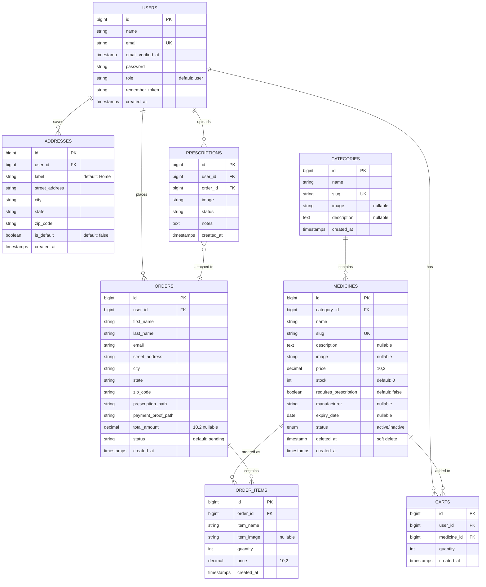
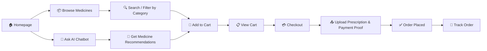
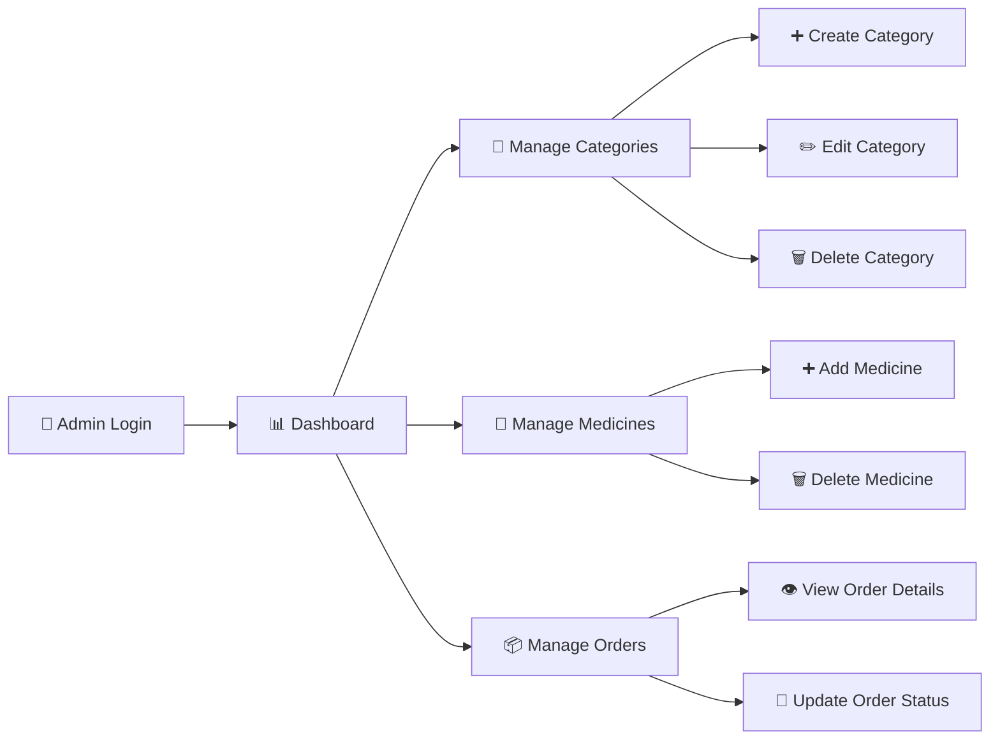
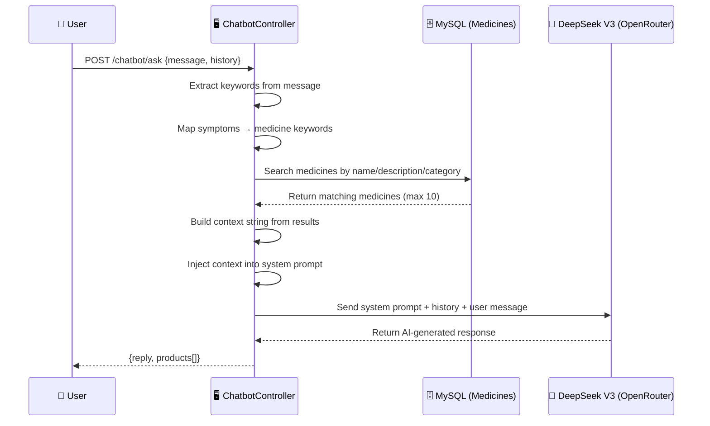

<p align="center">
  
</p>

<h1 align="center">💊 MediOrder AI</h1>

<p align="center">
  <strong>An AI-Powered Online Pharmacy & Medicine Ordering Platform</strong>
</p>

<p align="center">
  
  
  
  
  
  
  
</p>

<p align="center">
  <em>Browse medicines · Add to cart · Upload prescriptions · Get AI-powered health advice · Track your orders</em>
</p>

---

## 📋 Table of Contents

- [Overview](#-overview)
- [Key Features](#-key-features)
- [Tech Stack](#-tech-stack)
- [Architecture](#-architecture)
- [Database Schema](#-database-schema)
- [Project Structure](#-project-structure)
- [Installation & Setup](#-installation--setup)
- [Configuration](#-configuration)
- [Usage Guide](#-usage-guide)
- [API Reference](#-api-reference)
- [Route Map](#-route-map)
- [AI Chatbot](#-ai-chatbot)
- [Admin Panel](#-admin-panel)
- [Security](#-security)
- [Testing](#-testing)
- [Contributing](#-contributing)
- [License](#-license)

---

## 🌟 Overview

**MediOrder AI** is a full-stack online pharmacy platform that brings the convenience of digital medicine ordering together with the intelligence of AI-powered health assistance. Built on **Laravel 12**, the application provides a seamless experience for customers to browse medicines, manage prescriptions, place orders, and get instant pharmacist-level advice from an AI chatbot — all within a beautifully designed, responsive interface.

### 🎯 What Problem Does It Solve?

| Pain Point | MediOrder AI Solution |
|---|---|
| Long pharmacy queues | Order medicines from home with doorstep delivery |
| Uncertainty about medicines | AI chatbot provides instant, catalog-grounded health advice |
| Lost prescriptions | Digital prescription upload and storage |
| No order visibility | Real-time order tracking with status timeline |
| Manual inventory tracking | Admin dashboard with low-stock alerts and revenue analytics |

---

## ✨ Key Features

### 🛒 For Customers
- **Medicine Catalog** — Browse medicines by category with search & filter
- **Smart Search** — Search medicines by name or description
- **Shopping Cart** — Session-based cart with add/remove/quantity management
- **Prescription Upload** — Upload prescription images (JPG, PNG, PDF) during checkout
- **Saved Addresses** — Save and reuse shipping addresses with labels (Home, Office, etc.)
- **Order Tracking** — Visual timeline tracker showing order progress (Pending → Processing → Shipped → Delivered)
- **Order History** — View all past orders with detailed breakdowns
- **AI Pharmacist Chatbot** — Get medicine recommendations and health advice grounded in the product catalog

### 🔧 For Admins
- **Dashboard Analytics** — Today's orders, total revenue, low-stock alerts at a glance
- **Category Management** — Full CRUD with image uploads for medicine categories
- **Medicine Management** — Add/edit/delete medicines with detailed attributes (price, stock, manufacturer, expiry, prescription requirement)
- **Order Management** — View all orders, search/filter, update order status
- **Order Details** — View prescription uploads, payment proofs, and itemized breakdowns

### 🤖 AI-Powered
- **RAG-based Chatbot** — Retrieval-Augmented Generation using the medicine database as the knowledge base
- **Symptom-to-Medicine Mapping** — Intelligent keyword mapping (e.g., "fever" → paracetamol, ibuprofen)
- **Conversation History** — Multi-turn conversations with context retention
- **Product Card Suggestions** — Chatbot responses include interactive product cards

---

## 🔧 Tech Stack

| Layer | Technology | Purpose |
|---|---|---|
| **Backend Framework** | Laravel 12 | PHP application framework |
| **PHP Version** | 8.2+ | Language runtime |
| **Frontend CSS** | TailwindCSS 3.x | Utility-first CSS framework |
| **Frontend JS** | Alpine.js 3.x | Lightweight reactive framework |
| **Build Tool** | Vite 7 | Asset bundling and HMR |
| **Database** | MySQL | Relational data storage |
| **Session/Cache/Queue** | Database driver | Session, cache, and queue management |
| **Auth Scaffolding** | Laravel Breeze | Authentication views and logic |
| **AI Model** | DeepSeek Chat V3 (via OpenRouter) | Chatbot intelligence |
| **File Storage** | Laravel Filesystem (local/public) | Prescription & payment proof uploads |
| **Testing** | Pest PHP 3 | Testing framework |
| **Code Style** | Laravel Pint | PHP code formatting |
| **HTTP Client** | Axios | Frontend AJAX requests |

---

## 🏗 Architecture

### High-Level Architecture

```
┌─────────────────────────────────────────────────────────────────┐
│                        BROWSER (Client)                         │
│  ┌──────────┐  ┌──────────┐  ┌──────────┐  ┌────────────────┐  │
│  │ Blade    │  │ Tailwind │  │ Alpine.js│  │ Axios (AJAX)   │  │
│  │ Templates│  │ CSS      │  │ Reactive │  │ Chatbot Calls  │  │
│  └──────────┘  └──────────┘  └──────────┘  └────────────────┘  │
└───────────────────────────┬─────────────────────────────────────┘
                            │ HTTP Requests
                            ▼
┌─────────────────────────────────────────────────────────────────┐
│                     LARAVEL 12 APPLICATION                      │
│                                                                 │
│  ┌─────────────────────────────────────────────────────────┐    │
│  │                    ROUTING LAYER                        │    │
│  │  web.php (public + auth + admin)  │  auth.php (Breeze)  │    │
│  └──────────────────────┬──────────────────────────────────┘    │
│                         │                                       │
│  ┌──────────────────────▼──────────────────────────────────┐    │
│  │                  MIDDLEWARE LAYER                        │    │
│  │  auth │ guest │ admin (role-based) │ throttle │ signed   │    │
│  └──────────────────────┬──────────────────────────────────┘    │
│                         │                                       │
│  ┌──────────────────────▼──────────────────────────────────┐    │
│  │                  CONTROLLER LAYER                       │    │
│  │                                                         │    │
│  │  MedicineController    │  CartController                │    │
│  │  CheckoutController    │  OrderController               │    │
│  │  AdminDashboardCtrl    │  UserOrderController           │    │
│  │  ChatbotController     │  ProfileController             │    │
│  │  Admin\CategoryCtrl    │  Admin\MedicineCtrl            │    │
│  └──────────────────────┬──────────────────────────────────┘    │
│                         │                                       │
│  ┌──────────────────────▼──────────────────────────────────┐    │
│  │                    MODEL LAYER (Eloquent)               │    │
│  │                                                         │    │
│  │  User  │ Medicine │ Category │ Cart │ Order │ OrderItem │    │
│  │  Address │ Prescription                                 │    │
│  └──────────────────────┬──────────────────────────────────┘    │
│                         │                                       │
└─────────────────────────┼───────────────────────────────────────┘
                          │
           ┌──────────────┼──────────────┐
           ▼              ▼              ▼
     ┌──────────┐  ┌──────────┐  ┌──────────────┐
     │  MySQL   │  │  File    │  │  OpenRouter   │
     │ Database │  │  Storage │  │  API (AI)     │
     └──────────┘  └──────────┘  └──────────────┘
```

### Request Lifecycle

```
User Request → Route Matching → Middleware Check → Controller Action
     → Business Logic → Eloquent Query → Database
     → Data Transformation → Blade View Rendering → HTTP Response
```

---

## 🗄 Database Schema

### Entity Relationship Diagram



### Table Summary

| Table | Records | Purpose |
|---|---|---|
| `users` | Dynamic | Registered customers and admin users |
| `categories` | ~10-50 | Medicine categories (e.g., Pain Relief, Antibiotics) |
| `medicines` | ~100-1000+ | Product catalog with pricing and stock |
| `carts` | Dynamic | Persistent cart items per user |
| `orders` | Dynamic | Placed orders with shipping + payment info |
| `order_items` | Dynamic | Individual line items within each order |
| `addresses` | Dynamic | Saved shipping addresses per user |
| `prescriptions` | Dynamic | Uploaded prescription images linked to orders |
| `sessions` | Dynamic | Active user sessions (database driver) |
| `cache` | Dynamic | Application cache entries |
| `jobs` / `failed_jobs` | Dynamic | Background queue jobs |

---

## 📁 Project Structure

```
mediorderai/
├── app/
│   ├── Console/Commands/              # Artisan commands
│   ├── Http/
│   │   ├── Controllers/
│   │   │   ├── Admin/
│   │   │   │   ├── CategoryController.php    # CRUD for categories
│   │   │   │   └── MedicineController.php    # CRUD for medicines
│   │   │   ├── Auth/                         # Breeze auth controllers
│   │   │   ├── AdminDashboardController.php  # Admin analytics dashboard
│   │   │   ├── CartController.php            # Session-based cart
│   │   │   ├── ChatbotController.php         # AI chatbot (RAG pipeline)
│   │   │   ├── CheckoutController.php        # Checkout & order placement
│   │   │   ├── MedicineController.php        # Public medicine browsing
│   │   │   ├── OrderController.php           # Admin order management
│   │   │   ├── ProfileController.php         # User profile CRUD
│   │   │   └── UserOrderController.php       # Customer order tracking
│   │   ├── Middleware/
│   │   │   └── AdminMiddleware.php           # Role-based admin guard
│   │   └── Requests/
│   │       └── ProfileUpdateRequest.php      # Profile form validation
│   ├── Models/
│   │   ├── Address.php          # Saved shipping addresses
│   │   ├── Cart.php             # Shopping cart items
│   │   ├── Category.php         # Medicine categories
│   │   ├── Medicine.php         # Medicine products (soft deletes)
│   │   ├── Order.php            # Customer orders
│   │   ├── Orderitem.php        # Order line items
│   │   ├── Prescription.php     # Prescription uploads
│   │   └── User.php             # User accounts (role-based)
│   ├── Providers/               # Service providers
│   └── View/Components/         # Blade view components
│
├── bootstrap/
│   └── app.php                  # App bootstrap + middleware aliases
│
├── config/
│   ├── app.php                  # Application config
│   ├── auth.php                 # Authentication config
│   ├── database.php             # Database connections
│   ├── services.php             # Third-party services (OpenRouter)
│   └── ...                      # Cache, queue, mail, session, etc.
│
├── database/
│   ├── migrations/
│   │   ├── create_users_table              # Users + sessions + password resets
│   │   ├── create_catagories_table         # Medicine categories
│   │   ├── create_medicines_table          # Medicine products
│   │   ├── create_carts_table              # Shopping carts
│   │   ├── create_orders_table             # Orders
│   │   ├── create_order_items_table        # Order line items
│   │   └── create_addresses_table          # Saved addresses
│   ├── factories/               # Model factories (testing)
│   └── seeders/                 # Database seeders
│
├── resources/
│   ├── css/                     # Stylesheets (compiled via Vite)
│   ├── js/                      # JavaScript (Alpine.js, Axios)
│   └── views/
│       ├── admin/
│       │   ├── dashboard.blade.php          # Admin analytics page
│       │   ├── categories.blade.php         # Category list
│       │   ├── categories/                  # Create/edit category forms
│       │   └── medicines/                   # Create/list medicines
│       ├── auth/                            # Login, register, forgot password
│       ├── cart/
│       │   └── shopingcart.blade.php        # Shopping cart page
│       ├── checkout/
│       │   ├── index.blade.php              # Checkout form
│       │   └── success.blade.php            # Order confirmation
│       ├── components/
│       │   ├── chatbot.blade.php            # AI chatbot widget
│       │   └── ...                          # UI components (buttons, modals)
│       ├── layouts/
│       │   ├── app.blade.php                # Main authenticated layout
│       │   ├── guest.blade.php              # Guest layout
│       │   ├── navigation.blade.php         # Customer navbar
│       │   ├── adminnav.blade.php           # Admin navbar
│       │   ├── sidebar.blade.php            # Admin sidebar
│       │   └── footer.blade.php             # Site footer
│       ├── medicines/
│       │   ├── products.blade.php           # Product listing page
│       │   └── results.blade.php            # Search results page
│       ├── myorders/
│       │   ├── index.blade.php              # Order history list
│       │   └── track.blade.php              # Order tracking timeline
│       ├── orders/
│       │   ├── index.blade.php              # Admin order list
│       │   └── show.blade.php               # Admin order detail
│       ├── profile/                         # User profile pages
│       └── welcome.blade.php               # Homepage / landing page
│
├── routes/
│   ├── web.php                  # All web routes (public + auth + admin)
│   ├── auth.php                 # Breeze authentication routes
│   └── console.php              # Console/scheduler routes
│
├── public/                      # Publicly accessible assets
├── storage/                     # File uploads, logs, cache
├── tests/                       # Pest PHP test suites
│
├── .env.example                 # Environment variable template
├── composer.json                # PHP dependencies
├── package.json                 # NPM dependencies
├── tailwind.config.js           # Tailwind CSS configuration
├── vite.config.js               # Vite build configuration
└── artisan                      # Laravel CLI
```

---

## 🚀 Installation & Setup

### Prerequisites

| Requirement | Minimum Version |
|---|---|
| PHP | 8.2+ |
| Composer | 2.x |
| Node.js | 18+ |
| npm | 9+ |
| MySQL | 8.0+ |

### Quick Start

```bash
# 1. Clone the repository
git clone https://github.com/your-username/mediorderai.git
cd mediorderai

# 2. Install PHP dependencies
composer install

# 3. Set up environment
cp .env.example .env
php artisan key:generate

# 4. Configure your database in .env
#    DB_CONNECTION=mysql
#    DB_HOST=127.0.0.1
#    DB_PORT=3306
#    DB_DATABASE=mediorder
#    DB_USERNAME=root
#    DB_PASSWORD=

# 5. Run database migrations
php artisan migrate

# 6. Create storage symlink (for file uploads)
php artisan storage:link

# 7. Install frontend dependencies
npm install

# 8. Start the development server
composer dev
```

> **💡 Tip:** The `composer dev` command starts the PHP dev server, queue listener, and Vite HMR simultaneously using `concurrently`.

### One-Command Setup

```bash
composer setup    # Runs install, .env copy, key:generate, migrate, npm install, npm build
```

---

## ⚙️ Configuration

### Environment Variables

| Variable | Description | Default |
|---|---|---|
| `APP_NAME` | Application name | `Laravel` |
| `APP_URL` | Application URL | `http://localhost` |
| `DB_CONNECTION` | Database driver | `mysql` |
| `DB_DATABASE` | Database name | `mediorder` |
| `DB_USERNAME` | Database user | `root` |
| `DB_PASSWORD` | Database password | *(empty)* |
| `OPENROUTER_API_KEY` | API key for OpenRouter (AI chatbot) | *(required for chatbot)* |
| `SESSION_DRIVER` | Session storage backend | `database` |
| `QUEUE_CONNECTION` | Queue driver | `database` |
| `CACHE_STORE` | Cache backend | `database` |
| `MAIL_MAILER` | Mail driver | `log` |

### AI Chatbot Setup

1. Sign up at [OpenRouter.ai](https://openrouter.ai)
2. Generate an API key
3. Add to `.env`:
   ```
   OPENROUTER_API_KEY=your-api-key-here
   ```
4. The chatbot uses the **DeepSeek Chat V3** model (`deepseek/deepseek-chat-v3-0324`)

---

## 📖 Usage Guide

### 👤 Customer Flow



1. **Browse & Search** — Visit `/medicines` to see the full catalog. Use category filters or the search bar.
2. **Add to Cart** — Click "Add to Cart" on any medicine card. Cart is session-based (persists across pages).
3. **Checkout** — Go to `/checkout`. Fill in shipping info, optionally select a saved address, upload prescription and payment proof.
4. **Order Confirmation** — Receive an order ID and success confirmation.
5. **Track Orders** — Visit `/myorders` to see your order history and click into any order for a detailed timeline.
6. **AI Chatbot** — Click the chatbot widget (bottom-right) to ask health questions. The AI searches the medicine database and provides grounded recommendations.

### 🛠 Admin Flow



1. **Access** — Navigate to `/admin/dashboard`. Requires a user with `role = 'admin'`.
2. **Dashboard** — View today's orders, total revenue, and low-stock medicine alerts.
3. **Categories** — Create, edit, and delete medicine categories with images.
4. **Medicines** — Add new medicines with full details (category, price, stock, prescription requirement, manufacturer, expiry date, status).
5. **Orders** — Search/filter orders, view detailed breakdowns, update status (pending → processing → shipped → delivered → cancelled).

---

## 🔌 API Reference

### Chatbot Endpoint

```
POST /chatbot/ask
```

| Parameter | Type | Required | Description |
|---|---|---|---|
| `message` | string | ✅ | User's message (max 1000 chars) |
| `history` | array | ❌ | Conversation history (max 20 entries) |
| `history.*.role` | string | ✅* | `user` or `assistant` |
| `history.*.content` | string | ✅* | Message content |

**Response:**
```json
{
  "reply": "Based on our catalog, I recommend **Paracetamol 500mg** (₹25.00)...",
  "products": [
    {
      "id": 1,
      "name": "Paracetamol 500mg",
      "slug": "paracetamol-500mg",
      "price": "25.00",
      "image": "http://localhost/storage/medicines/paracetamol.jpg",
      "requires_prescription": false,
      "category": "Pain Relief",
      "manufacturer": "Cipla"
    }
  ]
}
```

---

## 🗺 Route Map

### Public Routes (No Authentication)

| Method | URI | Controller | Name | Description |
|---|---|---|---|---|
| `GET` | `/` | Closure | — | Homepage with categories & medicines |
| `GET` | `/medicines` | `MedicineController@index` | `medicines.index` | Medicine catalog with category filter |
| `GET` | `/medicines/{slug}` | `MedicineController@show` | `medicines.show` | Single medicine detail page |
| `GET` | `/products` | `MedicineController@index` | `products.index` | Alias for medicines catalog |
| `GET` | `/search` | `MedicineController@search` | `medicines.search` | Search results page |
| `POST` | `/chatbot/ask` | `ChatbotController@ask` | `chatbot.ask` | AI chatbot API endpoint |

### Authenticated Routes (`auth` middleware)

| Method | URI | Controller | Name | Description |
|---|---|---|---|---|
| `GET` | `/profile` | `ProfileController@edit` | `profile.edit` | Edit user profile |
| `PATCH` | `/profile` | `ProfileController@update` | `profile.update` | Update user profile |
| `DELETE` | `/profile` | `ProfileController@destroy` | `profile.destroy` | Delete user account |
| `GET` | `/cart` | `CartController@index` | `cart.index` | View shopping cart |
| `POST` | `/cart/add/{id}` | `CartController@add` | `cart.add` | Add item to cart |
| `DELETE` | `/cart/remove/{id}` | `CartController@remove` | `cart.remove` | Remove item from cart |
| `GET` | `/checkout` | `CheckoutController@index` | `checkout.index` | Checkout page |
| `POST` | `/checkout/store` | `CheckoutController@store` | `checkout.store` | Place order |
| `DELETE` | `/checkout/address/{id}` | `CheckoutController@deleteAddress` | `checkout.address.delete` | Delete saved address |
| `GET` | `/myorders` | `UserOrderController@index` | `myorders.index` | Order history |
| `GET` | `/myorders/{id}` | `UserOrderController@track` | `myorders.track` | Track specific order |

### Admin Routes (`admin` middleware, `/admin` prefix)

| Method | URI | Controller | Name | Description |
|---|---|---|---|---|
| `GET` | `/admin/dashboard` | `AdminDashboardController@getDashboard` | `admin.dashboard` | Admin analytics |
| `GET` | `/admin/categories` | `Admin\CategoryController@index` | `admin.categories.index` | List categories |
| `GET` | `/admin/categories/create` | `Admin\CategoryController@create` | `admin.categories.create` | Create category form |
| `POST` | `/admin/categories` | `Admin\CategoryController@store` | `admin.categories.store` | Store new category |
| `GET` | `/admin/categories/{id}/edit` | `Admin\CategoryController@edit` | `admin.categories.edit` | Edit category form |
| `PUT` | `/admin/categories/{id}` | `Admin\CategoryController@update` | `admin.categories.update` | Update category |
| `DELETE` | `/admin/categories/{id}` | `Admin\CategoryController@destroy` | `admin.categories.destroy` | Delete category |
| `GET` | `/admin/medicines` | `Admin\MedicineController@index` | `admin.medicines.index` | List medicines |
| `GET` | `/admin/medicines/create` | `Admin\MedicineController@create` | `admin.medicines.create` | Add medicine form |
| `POST` | `/admin/medicines` | `Admin\MedicineController@store` | `admin.medicines.store` | Store new medicine |
| `DELETE` | `/admin/medicines/{id}` | `Admin\MedicineController@destroy` | `admin.medicines.destroy` | Delete medicine |
| `GET` | `/admin/orders` | `OrderController@index` | `admin.orders.index` | List all orders |
| `GET` | `/admin/orders/{id}` | `OrderController@show` | `admin.orders.show` | View order detail |
| `PATCH` | `/admin/orders/{id}/status` | `OrderController@updateStatus` | `admin.orders.update-status` | Update order status |

### Authentication Routes (Laravel Breeze)

| Method | URI | Name | Description |
|---|---|---|---|
| `GET` | `/register` | `register` | Registration form |
| `POST` | `/register` | — | Handle registration |
| `GET` | `/login` | `login` | Login form |
| `POST` | `/login` | — | Handle login |
| `POST` | `/logout` | `logout` | Log out |
| `GET` | `/forgot-password` | `password.request` | Password reset request |
| `POST` | `/forgot-password` | `password.email` | Send reset link |
| `GET` | `/reset-password/{token}` | `password.reset` | Password reset form |
| `POST` | `/reset-password` | `password.store` | Handle password reset |
| `GET` | `/verify-email` | `verification.notice` | Email verification prompt |
| `GET` | `/verify-email/{id}/{hash}` | `verification.verify` | Verify email |
| `GET` | `/confirm-password` | `password.confirm` | Confirm password form |
| `PUT` | `/password` | `password.update` | Update password |

---

## 🤖 AI Chatbot

### How It Works (RAG Pipeline)

The chatbot uses a **Retrieval-Augmented Generation (RAG)** architecture:



### Symptom-to-Medicine Mapping

The chatbot includes a built-in keyword mapping for common health queries:

| Symptom | Mapped Keywords |
|---|---|
| Fever | paracetamol, ibuprofen, aspirin |
| Headache | paracetamol, ibuprofen, aspirin, pain |
| Cold / Cough | cetirizine, cough, cold, antihistamine, syrup |
| Stomach / Acidity | omeprazole, antacid, ors, loperamide |
| Infection | amoxicillin, azithromycin, antibiotic, betadine |
| Allergy | cetirizine, antihistamine |
| Diabetes | metformin |
| Vitamins / Supplements | vitamin, multivitamin, calcium, iron, folic |
| Wound | antiseptic, betadine, bandage |
| Diarrhea | ors, loperamide |
| Eye | eye, drops |
| Bone / Anemia | calcium, vitamin d, iron, folic |

### Safety Guardrails

- **Strict Grounding** — Responses are based exclusively on catalog data; no hallucinated products
- **Medical Disclaimer** — Automatic disclaimer for serious medical questions
- **Fallback Response** — "I don't have information on that" for unmatched queries
- **Rate Limiting** — Max 1000 characters per message, 20 history entries
- **Temperature 0.3** — Low randomness for consistent, factual responses

---

## 🛡 Admin Panel

### Dashboard Metrics

| Metric | Source | Description |
|---|---|---|
| **Today's Orders** | `Order::whereDate('created_at', today())` | Orders placed today |
| **Total Revenue** | `Order::where('status', '!=', 'Cancelled')->sum('total_amount')` | Revenue from non-cancelled orders |
| **Low Stock Alerts** | `Medicine::where('stock', '<', 11)` | Medicines with stock below 11 |
| **Recent Orders** | `Order::latest()->take(10)` | Last 10 orders with details |

### Order Status Workflow

```
pending → processing → shipped → delivered
    │                                  
    └──────→ cancelled                 
```

Each status transition is logged via `OrderController@updateStatus` and reflected in the customer's order tracking timeline.

---

## 🔒 Security

| Feature | Implementation |
|---|---|
| **Authentication** | Laravel Breeze (session-based, bcrypt hashed passwords) |
| **Password Hashing** | Bcrypt with 12 rounds |
| **Admin Authorization** | Custom `AdminMiddleware` checking `user.role === 'admin'` |
| **CSRF Protection** | Automatic via Laravel's `@csrf` directive in forms |
| **File Upload Validation** | Restricted to `pdf, jpg, jpeg, png`, max 2MB |
| **Input Validation** | Server-side validation in all controllers using `$request->validate()` |
| **Order Authorization** | `UserOrderController` verifies `order.user_id === Auth::id()` before showing details |
| **SQL Injection Prevention** | Eloquent ORM with parameterized queries |
| **XSS Prevention** | Blade's `{{ }}` auto-escaping |
| **Soft Deletes** | Medicines use soft deletes (data is preserved, not permanently removed) |
| **Duplicate Address Prevention** | Checkout checks for existing identical addresses before saving |

---

## 🧪 Testing

The project uses **Pest PHP 3** for testing.

```bash
# Run all tests
composer test

# Run tests directly
php artisan test

# Run with coverage
php artisan test --coverage
```

Test structure:
```
tests/
├── Feature/       # Integration/feature tests
├── Unit/          # Unit tests
└── Pest.php       # Pest configuration
```

---

## 🤝 Contributing

1. **Fork** the repository
2. **Create** a feature branch: `git checkout -b feature/my-feature`
3. **Commit** your changes: `git commit -m 'Add my feature'`
4. **Push** to the branch: `git push origin feature/my-feature`
5. **Open** a Pull Request

### Code Style

```bash
# Format code with Laravel Pint
./vendor/bin/pint
```

### Development Commands

| Command | Description |
|---|---|
| `composer dev` | Start dev server + queue + Vite HMR |
| `composer test` | Run test suite |
| `composer setup` | Full project setup |
| `php artisan migrate` | Run database migrations |
| `php artisan migrate:fresh` | Reset and re-run all migrations |
| `php artisan storage:link` | Create public storage symlink |
| `npm run dev` | Start Vite dev server |
| `npm run build` | Build production assets |

---

## 📄 License

This project is open-sourced software licensed under the [MIT License](https://opensource.org/licenses/MIT).

---

<p align="center">
  Made with ❤️ by <strong>Samrat</strong>
</p>

<p align="center">
  <em>MediOrder AI — Healthcare, simplified.</em>
</p>
